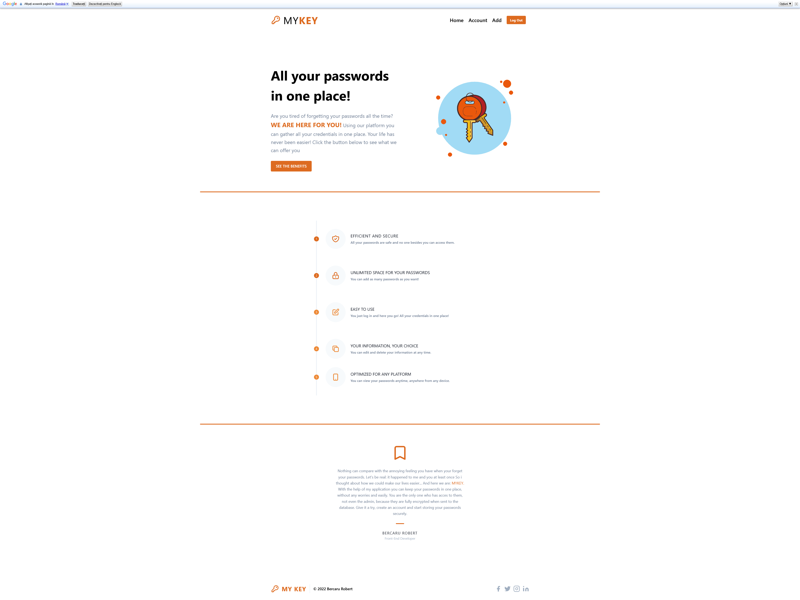
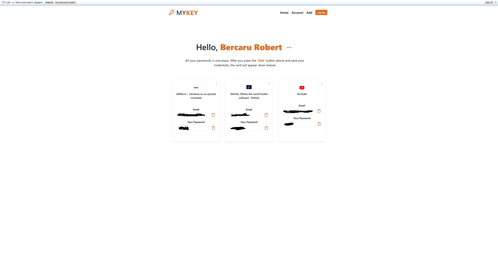
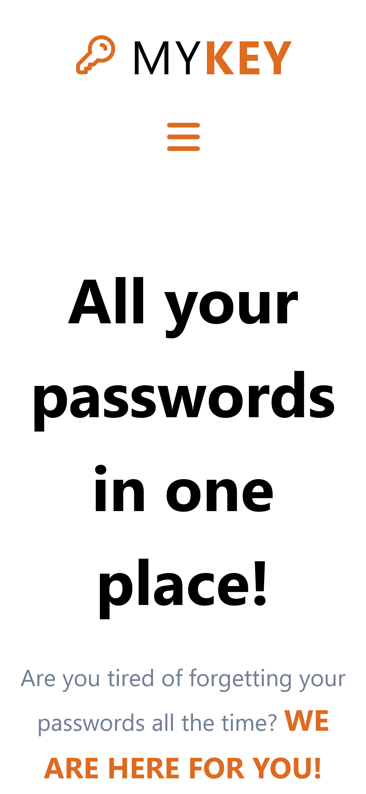
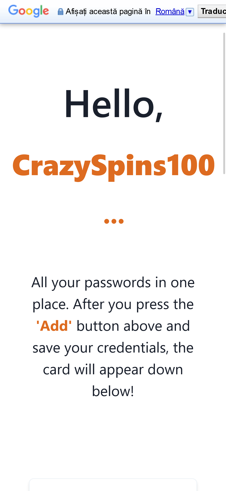
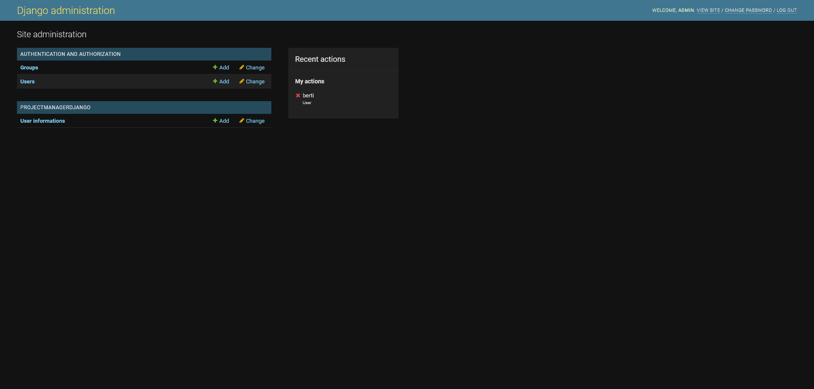

# MYKEY - ALL YOUR PASSWORDS IN ONE PLACE!

Acest proiect a fost realizat pentru Olimpiada de Inovare și Creație 2022

Documentația completă o găsiți in DOCUMENTATIE.DOCX

## Cuprins

- [Abstract](#abstract)
- [Despre](#despre)
- [Poze](#poze)
- [Links](#link-uri)
- [Tehnologii Folosite](#tehnologii)

## Abstract
 O parolă este un șir de caractere folosit pentru a verifica identitatea unui utilizator în timpul procesului de autentificare. Acestea sunt de obicei folosite în tandem cu un username. Ele sunt concepute pentru a fi cunoscute numai de utilizator și permit acestuia să obțină acces la un dispozitiv, aplicație sau site web. Parolele pot varia în lungime și pot conține litere, cifre și caractere speciale.

Aplicația MYKEY are ca scop ajutarea utilizatorului obișnuit prin stocarea parolelor si informațiilor necesare autentificării. Acest lucru se realizează într-o manieră eficientă, asigurând un echilibru între securitate și accesibilitate. Deși datele sunt salvate într-o bază de date, numai utilizatorul le cunoaște.

### Despre

MYKEY este o platforma dezvoltată pentru a ajuta utilizatorii web să nu mai uite parolele website-urilor pe care la folosesc.
Platforma noastră oferă utlizatorilor posibilitatea de a-și salva toate parolele într-un singur loc, simplu și rapid. Totul este securizat, datele personale sunt criptate, iar accesul la informații este unic.

MYKEY acceptă o multitudine de site-uri/platforme, astfel încat utilizatorul să își poata salva toate informațiile cu ajutorul câtorva click-uri.

Din punct de vedere al accesibilității, platforma oferă traducere in orice limbă (cu ajutorul script-ului de Google Translate al celor de la Google), putând fi astfel folosită de oricine.

Pentru a-și putea accesa contul, utilizatorul va primi un cod de verificare pe mail pe care mai apoi va trebui sa îl introduca in căsuța corespunzătoare. Pe lângă pagina de cont a utilizatorului (unde acesta își poate vizualiza parolele salvate), există și un Admin Dashboard (generat automat de Django) pentru a-i ușura viața administratorului.

Spre deosebire de alte aplicații similare, MYKEY vine cu design modern și prietenos, putând fii folosită atât de pe dispositive tip Desktop, cât și tablete și telefoane mobile.

### Poze

### Link-uri

- Solutia : [Aici](https://github.com/brobert04/passwdManager.git)
- Website: [Aici](https://mykey2022.herokuapp.com)

### Tehnologii
Tehnologii si Limbaje de Programare folosite:

•Partea de Frontend:

-HTML 5
-Vanilla Javascript

• Partea de Backend:

- Python

•Framework-uri folosite:

-TailwindCSS
-Django

•Baza de date:

-PostgreSQL
